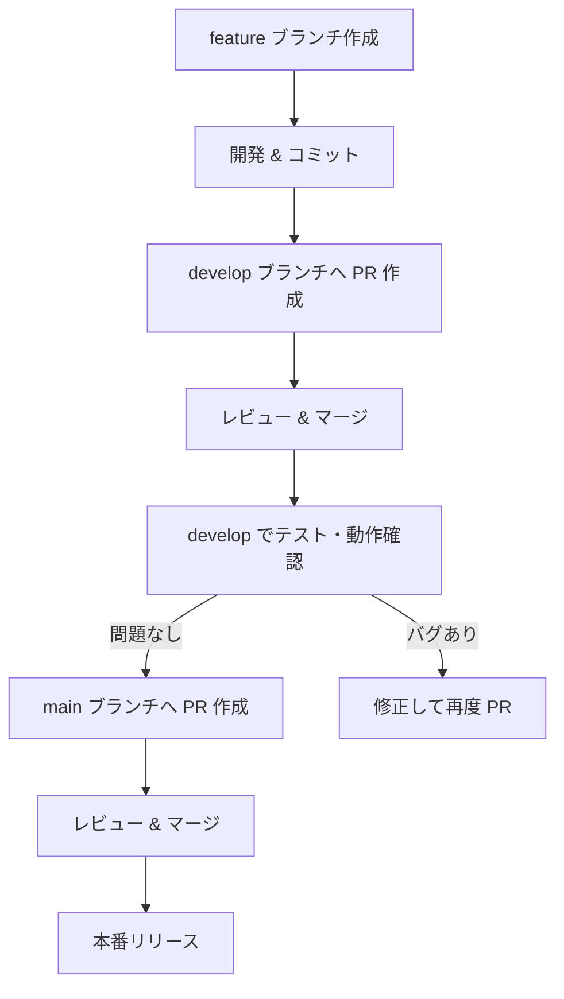

# ブランチ戦略

本プロジェクトは以下のブランチ運用ルールに従います。

## ブランチ構成

- **main**  
  本番環境リリース用ブランチ。動作確認済みでテストを通過したコードのみをマージする。

- **develop**  
  開発用ブランチ。新機能や修正はまずここにマージされる。

- **featureブランチ**  
  機能単位で `develop` から派生し、開発が完了したら `develop` にマージする。  
  命名規則： `f-develop_<機能名>` 例）`f-develop_function1`

## 運用ルール

1. 開発は `develop` から新しい `feature` ブランチを作成して進める。
2. `feature` ブランチで開発完了後、`develop` にマージする。
3. `develop` で動作確認およびテストを行い、問題がなければ `main` にマージする。
4. `main` には直接コミット・マージを行わない。

## イメージ図

```text
main
  ↑
  └── develop
        ├── f-develop_function1
        └── f-develop_function2
```

## PR フロー（Pull Request 流れ）

