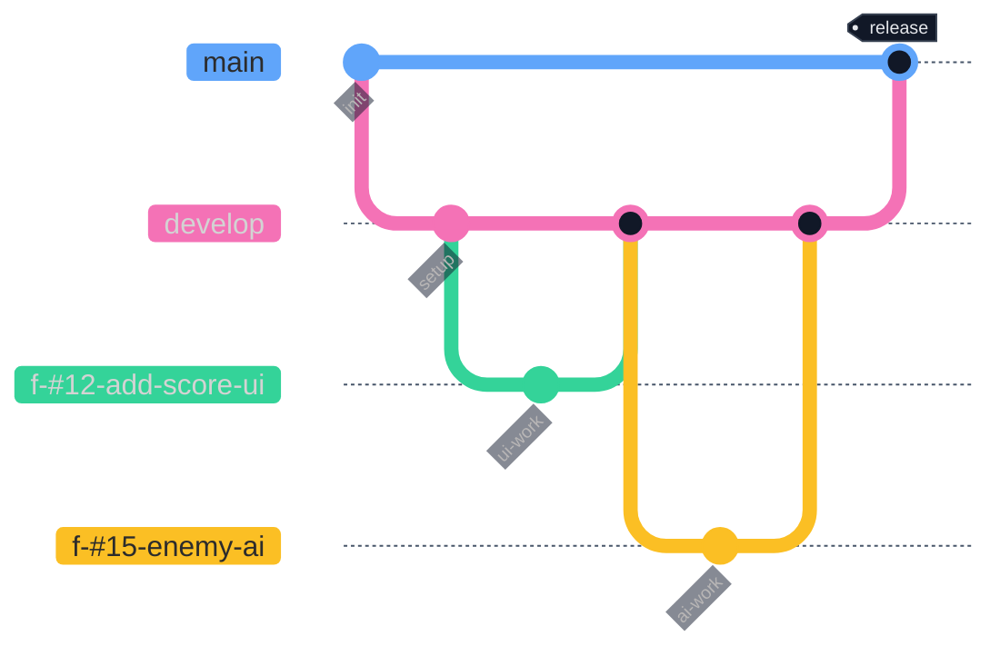

# developブランチの運用ルール

本プロジェクトでは、開発の中心となる **developブランチ** を軸に運用を行います。

---

## Issueの活用

### 粒度
- 基本は **半日〜1日程度で完了できるタスク単位** とする
- 大きすぎるタスクは細分化し、逆に細かすぎる修正はコミットだけで済ませる

### ラベル（タグ）の種類
- `feature` : 新機能
- `bug` : バグ修正
- `refactor` : リファクタリング
- `chore` : 環境構築・設定
- `documentation` : ドキュメント改善
- `priority: high` : 優先度が高いタスク

### 運用サイクル
1. 思いついたタスク・改善点はすべてIssueとして起票する
2. 優先度の高いIssueから `feature` ブランチを作成する  
   - ブランチ名には **Issue番号を含める**  
   例: `f-develop_#12-add-score-ui`
3. PRを作成し、レビューや自己チェックを行う
4. レビュー通過後、`develop` にマージすると同時にIssueをクローズする

---

## mainブランチへのマージ条件
- ある程度の機能がまとまったタイミング
- 対応したIssueが十分に片付いていること
- 動作確認とテストが完了していること

---

## ブランチ戦略

本プロジェクトでは、以下のようにブランチを運用します。

- **main** : 本番リリース用ブランチ。安定版コードのみを保持
- **develop** : 開発の基盤となるブランチ。新機能や修正はここに統合
- **feature** : 機能追加や修正単位で作成するブランチ。作業完了後にdevelopへマージ

