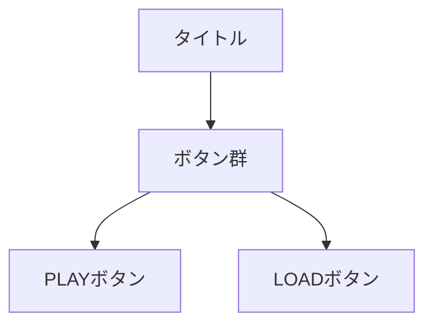
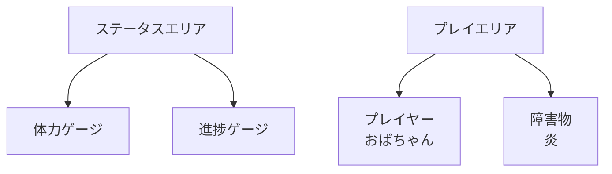
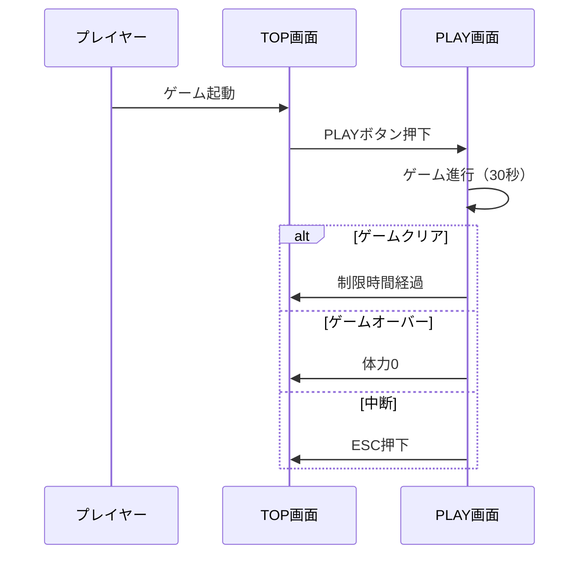

# 炎避けゲーム 要件定義書

## 1. 概要

本ドキュメントは、炎避けゲームの要件を定義するものです。
プレイヤーは制限時間内に炎を避けながら生存することを目指します。

## 2. 画面構成

### 2.1 画面一覧
- TOP画面：ゲーム開始前の初期画面
- PLAY画面：ゲームプレイ画面

### 2.2 画面詳細

#### 2.2.1 TOP画面
- **画面構成要素**
  - タイトル
  - ボタン群
    - PLAYボタン：ゲームを開始する
    - LOADボタン：セーブデータを読み込む

#### 2.2.2 PLAY画面
- **画面構成要素**
  - ステータスエリア（画面上部）
    - 体力ゲージ（左上）：100ptを10段階で表示
    - 進捗ゲージ（右上）：残り時間を表示
  - プレイエリア（画面中央）
    - プレイヤーキャラクター（おばちゃん）
    - 障害物（炎）

## 3. ゲームルール

### 3.1 基本ルール
- **制限時間**: 30秒
- **クリア条件**: 制限時間内に生存すること
- **体力システム**
  - 最大体力: 100pt
  - ダメージ: 炎との接触で10pt減少
  - ゲームオーバー: 体力が0ptになった時点

### 3.2 操作方法
- 左右矢印キー：プレイヤーの移動
- ESCキー：ゲーム中断（TOP画面に戻る）

## 4. ゲームフロー

## 5. 技術要件

### 5.1 画面仕様
- **解像度**: 800x600px（予定）
- **アスペクト比**: 4:3
- **フレームレート**: 60fps

### 5.2 ゲームバランス
- **炎の生成間隔**: 1秒
- **炎の落下速度**: 200px/秒
- **プレイヤー移動速度**: 300px/秒

## 6. 保存データ仕様

### 6.1 セーブデータ
- ハイスコア
- 最後にプレイした日時
- 累計プレイ時間

## 7. 今後の拡張性

### 7.1 追加検討機能
- スコアシステム
- 難易度選択
- キャラクターカスタマイズ
- ステージ選択
- 効果音・BGM
- パワーアップアイテム

## 8. 制約事項
- ブラウザ上で動作すること
- キーボード操作のみ対応
- モバイル端末は当面非対応

---
※本要件定義書は開発の進行に伴い、適宜更新されます。
